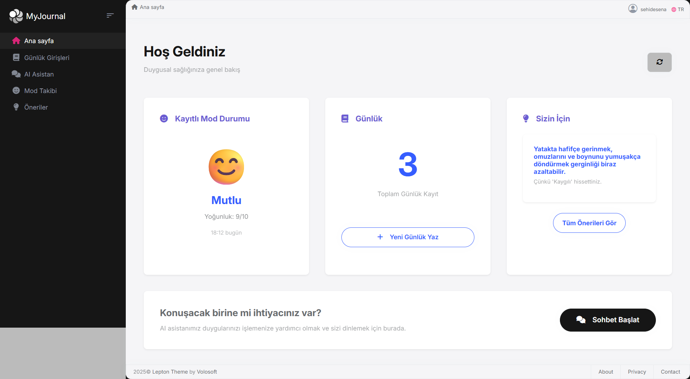
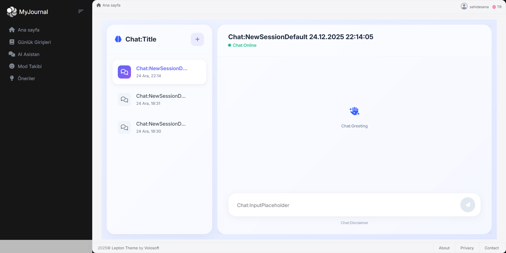

# MyJournal

**MyJournal** is an AI-powered mental health journaling platform designed to help users track their emotional well-being, get personalized insights, and receive supportive AI suggestions. Built with modern web technologies and the ABP Framework.

## 📸 Screenshots

### Dashboard


### AI Chatbot


## 🎯 Features

- **Smart Journaling**: Write journal entries and track your thoughts and feelings
- **AI-Powered Chatbot**: Get intelligent suggestions and personalized mental health support
- **Mood Tracking**: Monitor your emotional patterns over time
- **Voice Journaling**: Record voice entries with AI transcription
- **Personalized Recommendations**: AI-generated insights based on your journal entries
- **Secure Authentication**: OAuth 2.0 with OpenIddict
- **Multi-language Support**: Available in multiple languages

## 📋 Prerequisites

- [.NET 10.0+ SDK](https://dotnet.microsoft.com/download/dotnet)
- [Node.js v18 or v20](https://nodejs.org/en)
- [PostgreSQL](https://www.postgresql.org/download/)
- Azure OpenAI API Key
- Pinecone Vector Database account

## 🚀 Getting Started

### 1. Clone the Repository

```bash
git clone https://github.com/yourusername/MyJournal.git
cd MyJournal
```

### 2. Configure User Secrets

This project uses **.NET User Secrets** to store API keys and passwords securely.

```bash
cd Mentalfull

# Initialize User Secrets
dotnet user-secrets init

# Set Azure OpenAI Configuration
dotnet user-secrets set "Ai:ApiKey" "YOUR_AZURE_OPENAI_API_KEY"
dotnet user-secrets set "Ai:Endpoint" "YOUR_AZURE_OPENAI_ENDPOINT"

# Set Pinecone Configuration
dotnet user-secrets set "Pinecone:ApiKey" "YOUR_PINECONE_API_KEY"
dotnet user-secrets set "Pinecone:Host" "YOUR_PINECONE_HOST_URL"

# Set Database Connection
dotnet user-secrets set "ConnectionStrings:Default" "Host=localhost;Port=5432;Database=Mentalfull;User ID=postgres;Password=YOUR_PASSWORD;"

# Set Security Keys
dotnet user-secrets set "AuthServer:CertificatePassPhrase" "YOUR_CERTIFICATE_PASSPHRASE"
dotnet user-secrets set "StringEncryption:DefaultPassPhrase" "YOUR_ENCRYPTION_PASSPHRASE"
```

**Get API Keys:**
- **Azure OpenAI**: [Azure Portal](https://portal.azure.com/)
- **Pinecone**: [Pinecone.io](https://www.pinecone.io/)

### 3. Install Dependencies

```bash
# Install ABP CLI
dotnet tool install -g Volo.Abp.Cli

# Install client-side packages
abp install-libs
```

### 4. Setup Database

```bash
# Create database
createdb Mentalfull

# Run migrations
cd Mentalfull
dotnet ef database update
```

### 5. Generate Certificate

```bash
dotnet dev-certs https -v -ep openiddict.pfx -p YOUR_CERTIFICATE_PASSPHRASE
```

## 🏃 Running the Application

**Backend:**
```bash
cd Mentalfull
dotnet run
```
Backend: `https://localhost:44376`

**Frontend:**
```bash
cd angular
npm start
```
Frontend: `http://localhost:4200`

## � Tech Stack

- **Backend**: ASP.NET Core 10, Entity Framework Core
- **Frontend**: Angular 20, TypeScript
- **Database**: PostgreSQL
- **AI**: Azure OpenAI, Pinecone Vector Database
- **Authentication**: OAuth 2.0 with OpenIddict
- **Framework**: ABP Framework

## 🔐 Security

- OAuth 2.0 authentication with OpenIddict
- User Secrets for sensitive data (API keys never in source code)
- Encrypted data with configurable encryption keys
- Role-based access control (RBAC)

## 📖 API Documentation

Swagger UI: `https://localhost:44376/swagger`

## 🤝 Contributing

Contributions are welcome! Please feel free to submit a Pull Request.

## 📝 License

This project is licensed under the MIT License.

---

Built with ❤️ using [ABP Framework](https://abp.io)
